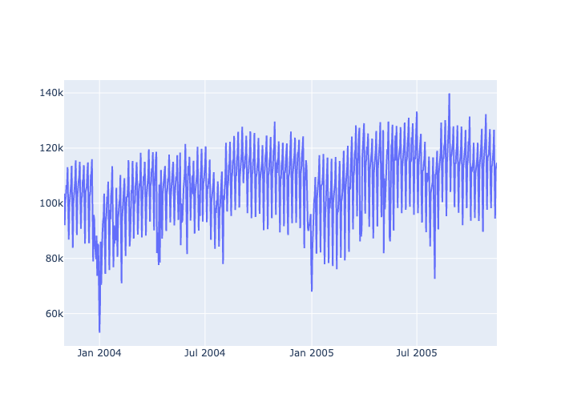
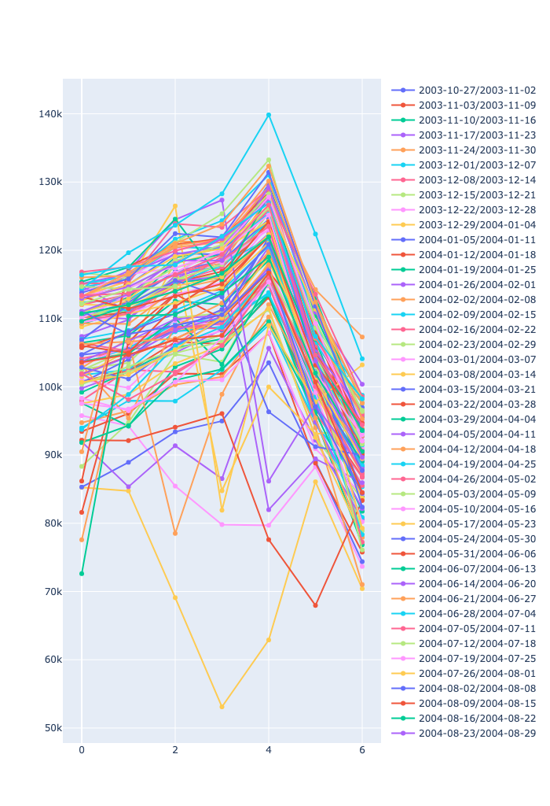
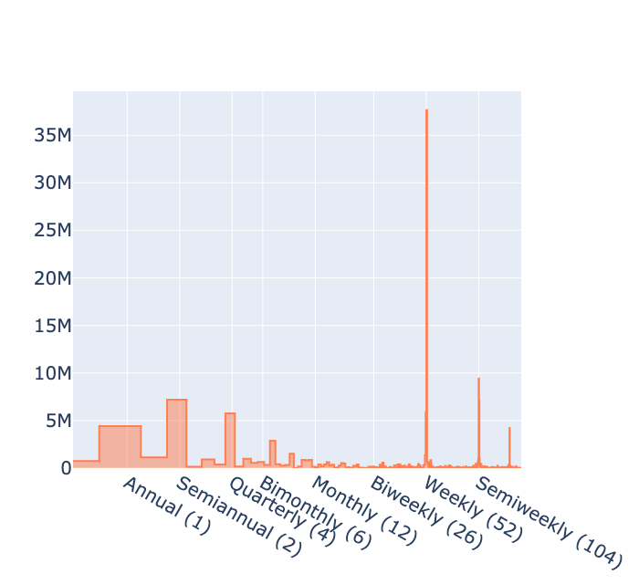
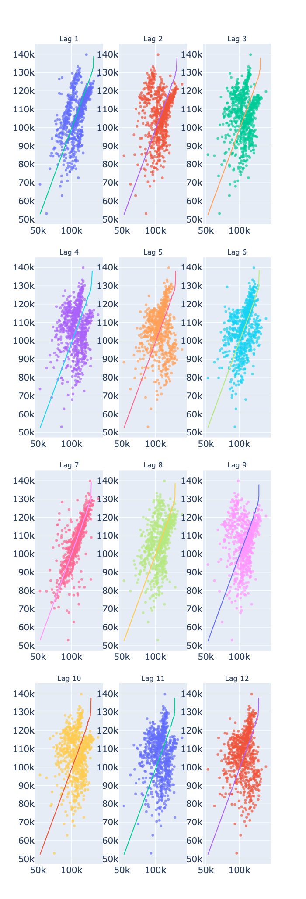
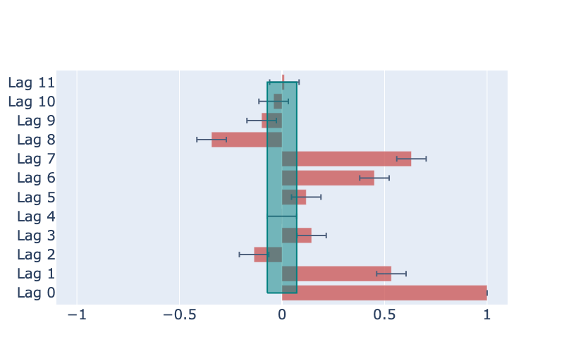
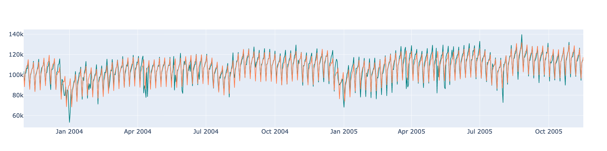

------------------------------------------------------------------
 # Tunnel Traffic  - Time Series Analysis TS1
------------------------------------------------------------------

## How to run the Demo

1. `> python3 seasonality.py`

------------------------------------------------------------------
## 1. Introduction

This is a part of tutorial project offered at Kaggle
by Ryan Holbrook and Alexis Cook.
https://www.kaggle.com/code/ryanholbrook/seasonality

We will to practice the routine procedures
commonly used in the time sequence analysis.


 Temporal sequence consists of several components.
 - Trend (gradual decrease / increase)
 - Seasonality (hour of day, day of week, week of month, month of year, etc.)
 - Cycles (up and down but with a specific time scale)
 - Peculiarity (national holidays, etc.)


 The list above is the whole features that one can
 predict by time-sequence analysis and machine-learning models.
 A model can predict what only repeats, i.e., what happened before.
 A model cannot learn from what did not happen yet.

 To deal with each elements of time sequence, we have

 - For __trend__ : Analytical fitting of the baselines (linear, polynomial, etc)
 - For __seasonality__ : Fourier decomposition.
 - For __cycle__ : Lags.
 - For __peculiarity__ : Categorical features.


 In this notebook we will familiarize ourselves with

  * Manipulation of index.
  * 'DeterministicProcess` in 'statsmodels' package.
    'DeterministicProcess` will be used to create 'time dummy'.


 'Time dummy's are the indices of target parameters.
 Index in other types of data is just a convenient unique address
 of a record to identify it. Since indices do not contain
 any useful information, they are usually dropped during the machine learning.
 On the contrary, index has special meaning in the time sequence analysis.
 It is the feature needed for the prediction.

 The manipulation of index in time sequence analysis include

 * Date parsing
 * Set date as index
 * Set period of date to 'D' (or 'M', 'W )
   + [offset aliases](https://pandas.pydata.org/pandas-docs/stable/user_guide/timeseries.html#offset-aliases)
 * Set `dtype` (category features to `category`)


 The only features (except categorical ones) used to model the  temporal
 behavior of the target parameter is the time, but the time in different
 intervals.
 'DeterministicProcess` help us to quickly create `t` in `y=f(t)`.
 It is called 'deterministic', because it is a feature that are prefixed.
 One can use such features at the time of prediction, i.e.
 if we would like to predict a sales on a Sunday, we can use the fact
 that day is a Sunday. On the contrary, we cannot use a sales one day before,
 on Saturday, if it is not published yet at the time the prediction.
 The former (=being a Sunday) is a deterministic feature, while the sales on
 Saturday is a non-deterministic feature.


 ## 2. Task

  We have a record of traffic of a tunnel. Model the temporal sequence of
  the traffic from the time features only.

 ## 3. Data

 1. A traffic of vehicles traveling through the Baregg Tunnel
    in Switzerland from November 2003 to November 2005.

------------------------------------------------------------------
## Directory Tree
```

├── LICENSE
├── README.md
├── images
│   ├── fig1.png
│   ├── fig2.png
│   ├── fig3.png
│   ├── fig4.png
│   ├── fig5.png
│   └── fig6.png
├── kaggle_tsa
│   ├── __init__.py
│   ├── __pycache__
│   │   ├── __init__.cpython-38.pyc
│   │   └── ktsa.cpython-38.pyc
│   └── ktsa.py
├── requirements.txt
└── seasonality.py

```
* ktsa is a python module that contains functions used in the exercise. 
------------------------------------------------------------------
## Output








```
<class 'pandas.core.frame.DataFrame'>
RangeIndex: 747 entries, 0 to 746
Data columns (total 2 columns):
 #   Column       Non-Null Count  Dtype 
---  ------       --------------  ----- 
 0   Day          747 non-null    object
 1   NumVehicles  747 non-null    int64 
dtypes: int64(1), object(1)
memory usage: 11.8+ KB
None
          Day  NumVehicles
0  2003-11-01       103536
1  2003-11-02        92051
2  2003-11-03       100795
<class 'pandas.core.frame.DataFrame'>
PeriodIndex: 747 entries, 2003-11-01 to 2005-11-16
Freq: D
Data columns (total 1 columns):
 #   Column       Non-Null Count  Dtype  
---  ------       --------------  -----  
 0   NumVehicles  747 non-null    float32
dtypes: float32(1)
memory usage: 8.8 KB
None
PeriodIndex(['2003-11-01', '2003-11-02', '2003-11-03', '2003-11-04',
             '2003-11-05', '2003-11-06', '2003-11-07', '2003-11-08',
             '2003-11-09', '2003-11-10',
             ...
             '2005-11-07', '2005-11-08', '2005-11-09', '2005-11-10',
             '2005-11-11', '2005-11-12', '2005-11-13', '2005-11-14',
             '2005-11-15', '2005-11-16'],
            dtype='period[D]', name='Day', length=747)
            NumVehicles
Day                    
2003-11-01     103536.0
2003-11-02      92051.0
2003-11-03     100795.0
Lag  1: 0.533
Lag  2: 0.187
Lag  3: 0.141
Lag  4: 0.123
Lag  5: 0.153
Lag  6: 0.443
Lag  7: 0.787
Lag  8: 0.424
Lag  9: 0.110
Lag 10: 0.077
Lag 11: 0.068
Lag 12: 0.074
            const  trend  s(2,7)  s(3,7)  s(4,7)  s(5,7)  s(6,7)  s(7,7)  \
Day                                                                        
2003-11-01    1.0    1.0     0.0     0.0     0.0     0.0     0.0     0.0   
2003-11-02    1.0    2.0     1.0     0.0     0.0     0.0     0.0     0.0   
2003-11-03    1.0    3.0     0.0     1.0     0.0     0.0     0.0     0.0   

            sin(1,freq=A-DEC)  cos(1,freq=A-DEC)  sin(2,freq=A-DEC)  \
Day                                                                   
2003-11-01          -0.867456           0.497513          -0.863142   
2003-11-02          -0.858764           0.512371          -0.880012   
2003-11-03          -0.849817           0.527078          -0.895839   

            cos(2,freq=A-DEC)  sin(3,freq=A-DEC)  cos(3,freq=A-DEC)  \
Day                                                                   
2003-11-01          -0.504961           0.008607          -0.999963   
2003-11-02          -0.474951          -0.043022          -0.999074   
2003-11-03          -0.444378          -0.094537          -0.995521   

            sin(4,freq=A-DEC)  cos(4,freq=A-DEC)  sin(5,freq=A-DEC)  \
Day                                                                   
2003-11-01           0.871706          -0.490029           0.858764   
2003-11-02           0.835925          -0.548843           0.899631   
2003-11-03           0.796183          -0.605056           0.933837   

            cos(5,freq=A-DEC)  sin(6,freq=A-DEC)  cos(6,freq=A-DEC)  \
Day                                                                   
2003-11-01           0.512371          -0.017213           0.999852   
2003-11-02           0.436651           0.085965           0.996298   
2003-11-03           0.357698           0.188227           0.982126   

            sin(7,freq=A-DEC)  cos(7,freq=A-DEC)  sin(8,freq=A-DEC)  \
Day                                                                   
2003-11-01          -0.875892           0.482508          -0.854322   
2003-11-02          -0.811539           0.584298          -0.917584   
2003-11-03          -0.735417           0.677615          -0.963471   

            cos(8,freq=A-DEC)  sin(9,freq=A-DEC)  cos(9,freq=A-DEC)  \
Day                                                                   
2003-11-01          -0.519744           0.025818          -0.999667   
2003-11-02          -0.397543          -0.128748          -0.991677   
2003-11-03          -0.267814          -0.280231          -0.959933   

            sin(10,freq=A-DEC)  cos(10,freq=A-DEC)  
Day                                                 
2003-11-01            0.880012           -0.474951  
2003-11-02            0.785650           -0.618671  
2003-11-03            0.668064           -0.744104  
RMSE : 5637.00
```
------------------------------------------------------------------
END

